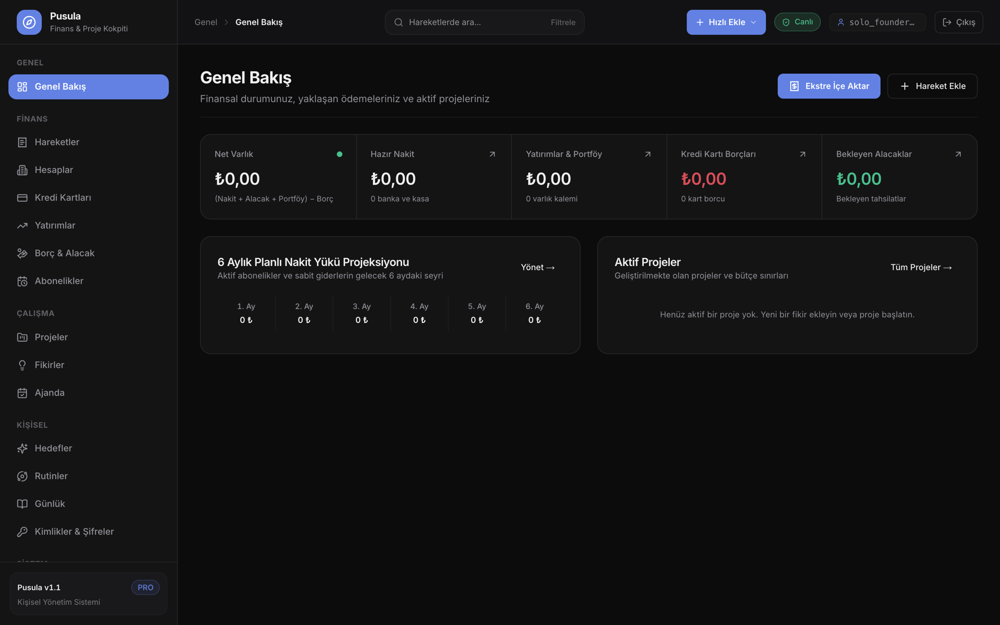
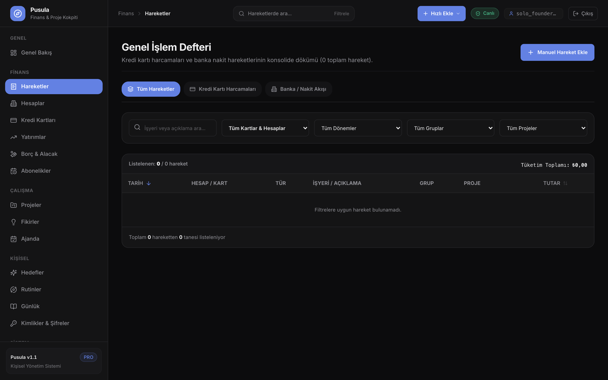
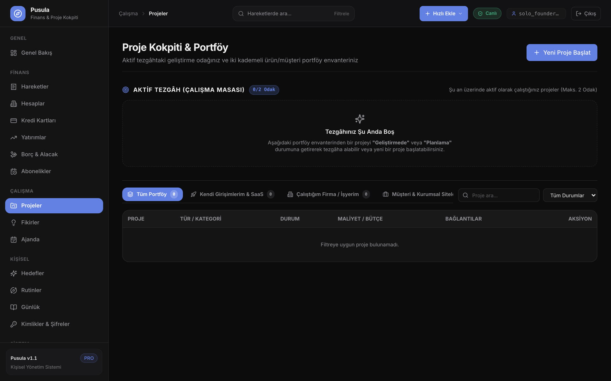
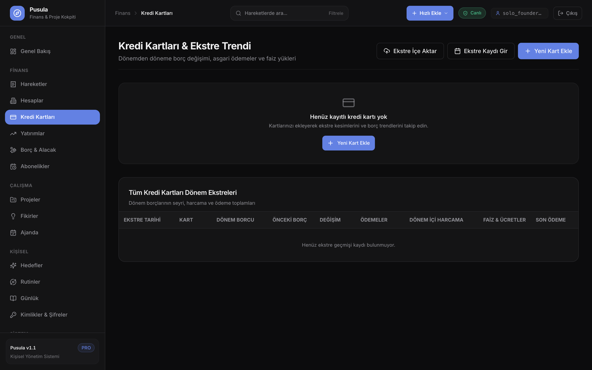
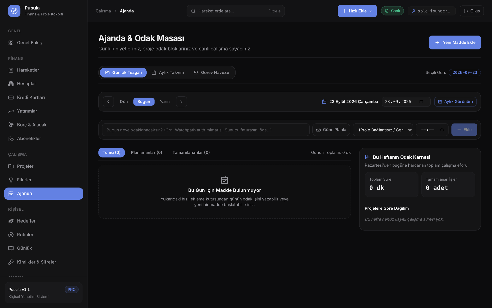

# 🧭 Pusula
### Kişisel Finans ve Proje Yönetim Paneli

[](https://nextjs.org/)
[](https://react.dev/)
[](https://www.typescriptlang.org/)
[](https://tailwindcss.com/)
[](https://supabase.com/)

> Geliştiriciler ve bağımsız çalışanlar için kişisel bütçe, kredi kartı ekstreleri ve proje harcamalarını tek ekranda toplayan yönetim aracı.

---

## 📸 Arayüz & Ekran Görüntüleri

### Finans & Proje Kokpiti


| Finansal Hareketler & Ledger | Proje & Fikir Portföyü |
|:---:|:---:|
|  |  |

| Kredi Kartları & Ekstre Trendi | Ajanda & Operasyonel Planlayıcı |
|:---:|:---:|
|  |  |

---

## 🛡️ Mühendislik Öne Çıkanları

- **İstemci Taraflı Ekstre Ayrıştırma:** Banka ekstreleri (PDF/XLSX), dosya sunucuya iletilmeden doğrudan tarayıcı belleğinde (`pdfjs-dist`) işlenir. Karakter glif restorasyonu ve regex kuralları ile işlem satırları, taksit detayları ve işyerleri otomatik normalize edilir.
- **Kuruş Hassasiyetli Finans Motoru:** Finansal hesaplamalar ve net varlık projeksiyonları, JavaScript'in kayan nokta (IEEE-754) yuvarlama sapmalarını önlemek amacıyla kuruş tabanlı sabit hassasiyetle hesaplanır.
- **İstemci Taraflı Şifrelenmiş Kasa:** Hassas kimlik ve parola kayıtları, Web Crypto API (`PBKDF2` anahtar türetimi ve `AES-GCM 256-bit`) ile istemci tarafında şifrelenir; veritabanında yalnızca şifrelenmiş veri saklanır.
- **İmleç Tabanlı (Keyset) Sayfalama:** Yüksek hareket hacmine sahip hesaplarda sayfalama performansı için geleneksel `OFFSET` yerine `(date, id)` demeti üzerinden imleç tabanlı çalışan atomik veritabanı yordamları (RPC) kullanılır.

---

## 🧩 Modül Ekosistemi

| Kategori | Modül | Açıklama |
|:---|:---|:---|
| **Finans** | **Kokpit** | Net varlık, hazır nakit, kredi kartı borçları, alacaklar ve 6 aylık nakit yükü özeti. |
| | **İşlem Hareketleri** | Banka ekstrelerinden otomatik ayrıştırma, harcama grupları ve işyeri eşleme defteri. |
| | **Kredi Kartları** | Kart limitleri, dönem ekstreleri ve borç değişim trendleri (▲/▼). |
| | **Hesaplar** | Vadesiz banka ve nakit kasa bakiyelerinin takibi. |
| | **Borç & Alacak** | Kişisel borçlar, maaş/hakediş alacakları ve tahsilat senkronizasyonu. |
| | **Abonelikler** | Düzenli SaaS ve lisans ödemeleri, 6 aylık nakit çıkış projeksiyonu. |
| | **Yatırımlar** | Yatırım varlıkları ve portföy dağılımı. |
| **Proje & Operasyon** | **Projeler & Fikirler** | Kanban iş akışı, bütçe tavanı takibi ve harcamalarla kurulan proje maliyet köprüsü. |
| | **Ajanda** | Günlük odak masası, zamanlayıcı ve taşınabilir görev listesi. |
| **Kişisel & Güvenlik** | **Rutinler & Alışkanlıklar**| Günlük takip, 3 seviyeli başarı skoru, streak zinciri ve mola/dondurma desteği. |
| | **Seyir Defteri (Jurnal)** | Markdown destekli günlük çalışma ve karar notları. |
| | **Hayaller & Hedefler** | Yaşam vizyonu ve orta/uzun vadeli hedefler. |
| | **Kasa (Credentials Vault)**| PBKDF2 + AES-GCM 256-bit şifrelenmiş istemci tarafı kimlik/parola kasası. |

---

## 🛠️ Teknoloji Yığını

- **Runtime:** Node.js >= 20.x (Önerilen: Node 22 LTS)
- **Frontend:** Next.js 16.3.5 (App Router, Turbopack), React 19, TypeScript, Tailwind CSS, Lucide Icons
- **Backend / Veritabanı:** Supabase (PostgreSQL 15+, Row Level Security, Auth, PL/pgSQL Atomic RPCs)
- **Ekstre & Doküman İşleme:** `pdfjs-dist` (Client-side PDF metin çıkarma & font glif restorasyonu), `xlsx`
- **Şifreleme:** Web Crypto API (PBKDF2 + AES-GCM 256-bit)
- **Test:** Vitest (Birim, entegrasyon ve veritabanı bütünlük testleri)

---

## 🚀 Kurulum ve Başlangıç

### 1. Gereksinimler
- Node.js `v20.0.0` veya üzeri
- Bir Supabase projesi (PostgreSQL veritabanı)

### 2. Ortam Değişkenleri
Örnek yapılandırma dosyasını kopyalayarak yerel `.env.local` dosyasını oluşturun:

```bash
cp .env.example .env.local
```

`.env.local` dosyasını kendi Supabase proje bilgilerinizle doldurun:
```env
NEXT_PUBLIC_SUPABASE_URL=https://your-project.supabase.co
NEXT_PUBLIC_SUPABASE_ANON_KEY=your-publishable-anon-key
```

> **Güvenlik Uyarısı:** `SUPABASE_SERVICE_ROLE_KEY` asla istemci tarafına veya repository'e konulmamalıdır; yalnızca yerel bakım/yönetim scriptleri için opsiyoneldir.

### 3. Veritabanı Şeması
`supabase/migrations/` dizininde projenin ihtiyaç duyduğu 25 adet SQL migrasyon dosyası yer almaktadır.

Bu dosyaları Supabase CLI ile veya Supabase Dashboard üzerindeki **SQL Editor** aracılığıyla `001`'den başlayarak sırayla uygulayabilirsiniz:

```bash
# Supabase CLI ile yerel veya uzak veritabanına aktarma:
supabase db push
```

### 4. Çalıştırma Komutları
```bash
# Bağımlılıkları yükle
npm install

# Geliştirme sunucusunu başlat (http://localhost:3000)
npm run dev

# Tip denetimi (TypeScript)
npm run typecheck

# Test süitini çalıştır (Vitest)
npm test

# Üretim derlemesi
npm run build
```

---

## 📚 Mimari & Tasarım Dokümanları

Pusula'nın mimari temelleri, domain modelleri ve ayrıştırma kuralları `docs/` klasöründe detaylandırılmıştır:

1. 🎯 [**Vizyon & Zihinsel Model** (`docs/VISION.md`)](docs/VISION.md) — Geliştiricilerin finansal ikilemleri ve finans-proje köprüsü felsefesi.
2. 🏛️ [**Domain Modeli & Varlık İlişkileri** (`docs/DOMAIN_MODEL.md`)](docs/DOMAIN_MODEL.md) — Veritabanı varlıkları, ilişkiler ve türetilen metrikler.
3. ⚡ [**Sistem Dinamikleri & Olay Akışları** (`docs/SYSTEM_DYNAMICS.md`)](docs/SYSTEM_DYNAMICS.md) — Finansal ve operasyonel olayların reaktif zincirleme akışı.
4. 📄 [**Ekstre Ayrıştırma Spesifikasyonu** (`docs/SPEC_PARSER.md`)](docs/SPEC_PARSER.md) — PDF/CSV ayrıştırma mimarisi ve glif restorasyon kuralları.
5. 🧪 [**Test Stratejisi** (`docs/TESTING_STRATEGY.md`)](docs/TESTING_STRATEGY.md) — Otomatik test piramidi ve kalite güvencesi ilkeleri.
6. 🗺️ [**Geliştirme Yol Haritası** (`docs/ROADMAP.md`)](docs/ROADMAP.md) — Tamamlanan aşamalar ve gelecek planları.

---

## 📄 Lisans

Bu proje için henüz seçilmiş bir açık kaynak lisansı bulunmamaktadır. Aksi belirtilmedikçe tüm hakları saklıdır.
