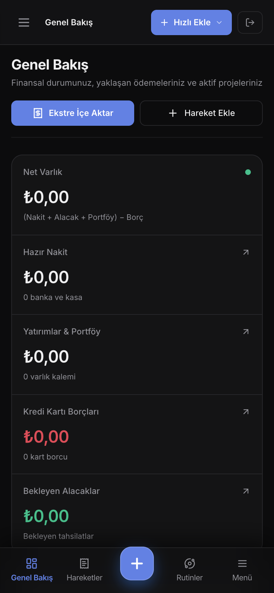
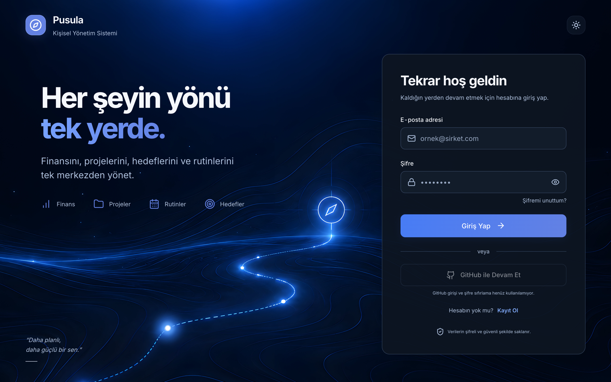
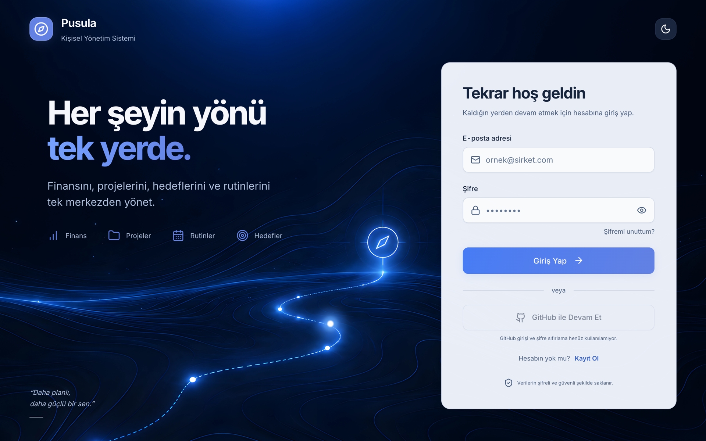

# 🧭 Pusula: Solo Kurucu Komuta Merkezi

> Kişisel finans ve proje yönetiminin tek bir ekranda buluştuğu, paranın nereden gelip nereye gittiğini ve projelerin bu denklemi nasıl etkilediğini gösteren bütünleşik solo kurucu işletim sistemi.

## 📸 Canlı Arayüz & Komuta Merkezi

| Finans & Proje Kokpiti | Finansal Hareketler & Ledger |
|:---:|:---:|
|  |  |

| Kredi Kartları & Hesaplar | Proje & Fikir Portföyü |
|:---:|:---:|
|  |  |

| Ajanda & Operasyonel Planlayıcı | Mobil Uyumlu Finans Kokpiti |
|:---:|:---:|
|  |  |

| Güvenli Giriş Portalı (Dark) | Giriş Portalı (Light) |
|:---:|:---:|
|  |  |

---

## 🧩 Modüller

| Modül | Açıklama |
|:---|:---|
| **Dashboard / Kokpit** | Net varlık, hazır para, kart borçları, alacaklar, harcama dağılımı, 6 aylık nakit yükü |
| **İşlem Hareketleri** | Banka ekstrelerinden otomatik ayrıştırma, analiz grubu, işyeri tanıma, proje atama |
| **Kredi Kartları & Hesaplar** | Kart listesi, ekstre geçmişi, borç trendi, nakit kasa yönetimi |
| **Borç & Alacak** | Maaş hakedişleri, kişi alacakları, tahsilat senkronizasyonu |
| **Abonelikler** | SaaS ve düzenli ödemeler, nakit yükü matrisi |
| **Projeler & Fikirler** | Kanban panosu, bütçe tavanı, gerçek maliyet köprüsü, fikir kuluçkası |
| **Ajanda** | Günlük görev masası, takvim görünümü, pomodoro zamanlayıcı |
| **Rutinler & Alışkanlıklar** | Günlük takip, 3 seviyeli tamamlama skoru, zincir (streak), dondurma |
| **Jurnal (Kaptanın Seyir Defteri)** | Günlük yansımalar, markdown düzenleyici |
| **Hayaller & Vizyon** | Yaşam hedefleri, ilerleme takibi |
| **Yatırımlar** | Yatırım portföyü, piyasa takibi |
| **Kasa (Credentials Vault)** | PBKDF2 + AES-GCM 256-bit istemci tarafı şifreli sır kasası |

---

## 📚 Mimari & Tasarım Dökümanları

Projenin tüm vizyon, veri modeli ve sistem dinamikleri `docs/` klasöründe detaylandırılmıştır:

1. 🎯 [**Vizyon & Zihinsel Model** (`docs/VISION.md`)](docs/VISION.md) — Solo kurucunun finansal & operasyonel kaosu ve Pusula'nın çözüm felsefesi.
2. 🏛️ [**Domain Modeli & Varlık İlişkileri** (`docs/DOMAIN_MODEL.md`)](docs/DOMAIN_MODEL.md) — Veritabanı varlıkları, ilişkiler ve türetilen metrikler.
3. ⚡ [**Sistem Dinamikleri & Olay Akışları** (`docs/SYSTEM_DYNAMICS.md`)](docs/SYSTEM_DYNAMICS.md) — Bir olay gerçekleştiğinde sistemin nasıl zincirleme tepki verdiği.
4. 📄 [**Ekstre Ayrıştırma Spesifikasyonu** (`docs/SPEC_PARSER.md`)](docs/SPEC_PARSER.md) — PDF/CSV parser, font onarım motoru ve onay ekranı kuralları.
5. 🗺️ [**Geliştirme Yol Haritası** (`docs/ROADMAP.md`)](docs/ROADMAP.md) — Aşama aşama geliştirme planı.
6. 🧩 [**Feature Öncelikleri** (`docs/FEATURE_PRIORITIES.md`)](docs/FEATURE_PRIORITIES.md) — Kademeli ürün yol haritası.

---

## 🛠️ Teknoloji Yığını (Tech Stack)

- **Runtime:** Node.js >= 20.x (Önerilen: Node 22 LTS)
- **Frontend:** Next.js 16.3.5 (App Router), React 19, TypeScript, Tailwind CSS, Lucide Icons
- **Backend / Veritabanı:** Supabase (PostgreSQL 15+, Row Level Security, Auth, PL/pgSQL Atomic Stored Procedures)
- **Ekstre & Doküman İşleme:** `pdfjs-dist` (Client-side PDF metin çıkarma & Axess Type3 font decoder), `xlsx`
- **Kasa Motoru:** Web Crypto API (PBKDF2 + AES-GCM 256-bit istemci tarafı şifreleme)
- **Test:** Vitest (Saf Finans Motoru, Atomik Köprü, Kasa, Parser ve Rutin Motoru testleri)

---

## 🚀 Başlangıç ve Kurulum

### 1. Gereksinimler
- Node.js `v20.0.0` veya üzeri
- Bir Supabase projesi (PostgreSQL veritabanı ile)

### 2. Ortam Değişkenleri

Örnek dosyayı kopyalayın ve kendi Supabase değerlerinizle doldurun:

```bash
cp .env.example .env.local
```

`.env.local` dosyasına en az şu değişkenleri ekleyin:
```env
NEXT_PUBLIC_SUPABASE_URL=https://your-project.supabase.co
NEXT_PUBLIC_SUPABASE_ANON_KEY=your-publishable-anon-key
```

> **Güvenlik Uyarısı:** `SUPABASE_SERVICE_ROLE_KEY` asla istemci tarafına veya genel repository'e konulmamalıdır. Yalnızca yetkili CLI bakım scriptleri için opsiyoneldir.

### 3. Veritabanı Migrasyonları
Supabase SQL Editor üzerinden sırasıyla çalıştırınız:

1. `supabase/migrations/001_initial_schema.sql`
2. `supabase/migrations/002_financial_bridge.sql`
3. `supabase/migrations/002_import_batch_and_rollback.sql`
4. `supabase/migrations/003_link_transactions_to_debts.sql`
5. `supabase/migrations/004_create_investments.sql`
6. `supabase/migrations/005_create_dreams.sql`
7. `supabase/migrations/006_create_routines_and_logs.sql`
8. `supabase/migrations/007_create_journal_entries.sql`
9. `supabase/migrations/008_security_and_financial_integrity.sql` *(Atomik stored procedure'lar, kilitler ve güvenlik sertleştirmeleri)*
10. `supabase/migrations/009_projects_ideas_redesign.sql`
11. `supabase/migrations/010_add_project_type.sql`
12. `supabase/migrations/011_create_agenda_items.sql`
13. `supabase/migrations/012_create_credentials_table.sql`
14. `supabase/migrations/013_lock_down_financial_rpcs.sql`
15. `supabase/migrations/014_qa_financial_integrity.sql`
16. `supabase/migrations/015_atomic_payments.sql`
17. `supabase/migrations/016_atomic_card_statement.sql`
18. `supabase/migrations/017_keyset_pagination_and_aggregates.sql`
19. `supabase/migrations/018_idempotent_atomic_import.sql`
20. `supabase/migrations/019_restore_atomic_debt_rpcs.sql`
21. `supabase/migrations/020_repair_transaction_financial_bridge.sql`
22. `supabase/migrations/021_atomic_user_workflows.sql`
23. `supabase/migrations/022_atomic_vault_replace.sql`
24. `supabase/migrations/023_repair_all_rls_policies.sql`
25. `supabase/migrations/024_fix_ideas_status_check.sql`
26. `supabase/migrations/025_make_agenda_plan_date_nullable.sql`

### 4. Komutlar
```bash
# Bağımlılıkları yükle
npm install

# Geliştirme sunucusunu başlat
npm run dev

# Tip denetimi (TypeScript)
npm run typecheck

# Otomatik testleri çalıştır (Vitest)
npm test

# Üretim derlemesi
npm run build
```
