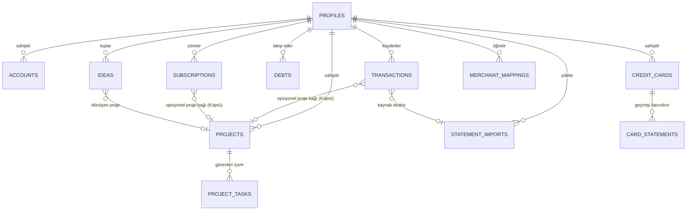

# 🏛️ Pusula — Domain Model & Varlık İlişkileri

Bu döküman, Pusula sistemindeki temel varlıkları (Entities), bu varlıkların ilişkilerini ve verilerin nasıl depolanıp nasıl türetildiğini (Stored vs. Derived) tanımlar.

---

## 1. Varlık İlişki Diyagramı (Entity Relationship)

---

## 2. Temel Varlıklar ve Alan Tanımları

### 1. `Accounts` (Hazır Para / Nakit / Vadesiz Hesaplar)
- **Amaç:** Kurucunun elindeki likit nakit mevcudunu tutar.
- **Alanlar:**
  - `id`: UUID (PK)
  - `user_id`: UUID (FK ➔ Profiles)
  - `name`: Text (Örn: "Garanti Vadesiz", "Enpara Vadesiz", "Nakit Cüzdan")
  - `type`: Text (`vadesiz`, `nakit`, `yatırım`)
  - `balance`: Numeric(12,2) (Güncel kullanılabilir bakiye)
  - `note`: Text

### 2. `CreditCards` (Kredi Kartları)
- **Amaç:** Aktif kredi kartı limitlerini, güncel borçlarını ve ödeme tarihlerini tutar.
- **Alanlar:**
  - `id`: UUID (PK)
  - `user_id`: UUID (FK ➔ Profiles)
  - `bank`: Text ("Akbank", "Enpara", "Ziraat", "Garanti")
  - `card_name`: Text ("Platinum • 1697", "Bankkart • 0887")
  - `last_four`: Text ("1697")
  - `current_debt`: Numeric(12,2) (Anlık toplam kart borcu)
  - `statement_debt`: Numeric(12,2) (Son kesilen ekstre dönem borcu)
  - `minimum_payment`: Numeric(12,2) (Asgari ödeme tutarı)
  - `statement_date`: Date (Son ekstre kesim tarihi)
  - `due_date`: Date (Son ödeme tarihi)
  - `status_note`: Text

### 3. `CardStatements` (Ekstre Geçmişi)
- **Amaç:** Her kartın aylık ekstre değişim trendini (borcun artış/azalışını) arşivler.
- **Alanlar:**
  - `id`: UUID (PK)
  - `card_id`: UUID (FK ➔ CreditCards)
  - `statement_date`: Date
  - `period_debt`: Numeric(12,2) (Dönem borcu)
  - `minimum`: Numeric(12,2)
  - `payments`: Numeric(12,2) (O dönem yapılan ödemeler)
  - `spending`: Numeric(12,2) (O dönem yapılan harcama/taksit)
  - `interest_fees`: Numeric(12,2) (Faiz/BSMV/KKDF yükü)
  - `prev_debt`: Numeric(12,2) (Bir önceki dönem borcu)
  - `change_amount`: Numeric(12,2) (`period_debt - prev_debt`)
  - `change_pct`: Numeric(8,4) (`change_amount / prev_debt`)

### 4. `Transactions` (Ana İşlem Defteri — Hareketler)
- **Amaç:** Tüm finansal para giriş ve çıkışlarının tekil atomik kaydıdır.
- **Alanlar:**
  - `id`: UUID (PK)
  - `user_id`: UUID (FK ➔ Profiles)
  - `date`: Date (İşlem tarihi)
  - `account_or_card`: Text (Hangi hesaptan/karttan yapıldığı)
  - `type`: Enum (`Harcama`, `Kart Ödemesi`, `Gelir`, `Tahsilat`, `Finansman/Masraf`, `İade`, `Borç Ödemesi`, `Nakit Avans`, `Transfer`)
  - `description`: Text (Ham ekstre açıklaması)
  - `amount`: Numeric(12,2) (Tutar)
  - `analysis_group`: Enum (`Kişisel`, `İş`, `Finansman`, `Hariç`)
  - `merchant`: Text (Normalize işyeri adı: "ŞOK", "Hostinger", "Canva")
  - `recurrence`: Text ("Düzenli", "Taksit (3/6)", null)
  - `statement_date`: Date (Ait olduğu ekstre dönemi)
  - `project_id`: UUID (FK ➔ Projects, **KÖPRÜ**)
  - `import_id`: UUID (FK ➔ StatementImports)

### 5. `Debts` (Borçlar & Kesin Alacaklar)
- **Amaç:** Kredi kartı dışındaki şahıs/kurum borçları ile maaş ve freelance kesin hakedişlerini takip eder.
- **Alanlar:**
  - `id`: UUID (PK)
  - `user_id`: UUID (FK ➔ Profiles)
  - `type`: Enum (`Borç`, `Alacak`)
  - `category`: Text ("Maaş", "Kişisel Borç", "Artı Para", "Proje Hakedişi")
  - `person_or_entity`: Text ("Hızır Global AŞ", "Ablam", "Akbank Artı Para")
  - `description`: Text
  - `principal`: Numeric(12,2) (Ana tutar)
  - `past_payments`: Numeric(12,2) (Geçmişte tahsil edilen/ödenen)
  - `remaining`: Numeric(12,2) (`principal - past_payments`)
  - `status`: Enum (`Açık`, `Kapatıldı`)
  - `linked_account_id`: UUID (FK ➔ Accounts, **Tahsilat/Ödemenin yansıyacağı hesap**)

### 6. `Subscriptions` (Abonelikler & Planlı Yük)
- **Amaç:** Aylık/yıllık tekrarlayan SaaS ve lisans maliyetlerini, bitiş tarihlerini ve kararları yönetir.
- **Alanlar:**
  - `id`: UUID (PK)
  - `user_id`: UUID (FK ➔ Profiles)
  - `service`: Text ("Cursor Pro", "ChatGPT Plus", "Hostinger")
  - `group`: Enum (`Kişisel`, `İş`)
  - `model`: Text ("Tekrarlayan", "Promosyon", "Ücretsiz")
  - `amount`: Numeric(12,2) (Sabit TL)
  - `period`: Enum (`Aylık`, `Yıllık`, `Tek Sefer`, `18 Ay`)
  - `end_date`: Date (Yenileme/bitiş tarihi)
  - `decision`: Enum (`Devam`, `İptal Et`, `Kararsız`)
  - `payment_method`: Text ("Bankkart • 0887")
  - `project_id`: UUID (FK ➔ Projects, **KÖPRÜ**)

### 7. `Projects` (Proje Portföyü)
- **Amaç:** Kurucunun geliştirdiği ürünlerin yaşam döngüsünü ve maliyetini yönetir.
- **Alanlar:**
  - `id`: UUID (PK)
  - `user_id`: UUID (FK ➔ Profiles)
  - `slug`: Text ("watchpath", "pusula")
  - `name`: Text
  - `description`: Text
  - `status`: Enum (`Fikir`, `Planlama`, `Geliştirmede`, `Canlı`, `Arşiv`)
  - `budget_limit`: Numeric(12,2) (Bütçe tavanı, örn: ₺20.000)
  - `repo_url`: Text
  - `live_url`: Text

---

## 3. Depolanan Veri vs. Anlık Türetilen Metrikler (Calculated/Derived)

Veri tutarsızlığını önlemek için bazı metrikler veritabanında statik tutulmaz, saf finans motoru tarafından anlık hesaplanır:

1. **Net Varlık (Net Worth):**
   $$\text{Net Varlık} = \sum \text{Accounts.balance} + \sum \text{Debts(Alacak).remaining} - \left( \sum \text{CreditCards.current\_debt} + \sum \text{Debts(Borç).remaining} \right)$$

2. **Proje Gerçek Maliyeti (Project Total Cost):**
   $$\text{Proje Maliyeti} = \sum \text{Transactions(project\_id).amount} + \sum \text{Subscriptions(project\_id).amount}$$

3. **Kurucu Runway (Aylık Hayatta Kalma Süresi):**
   $$\text{Runway (Ay)} = \frac{\sum \text{Accounts.balance}}{\text{Aylık Kişisel Tüketim} + \text{Aylık Proje Yakma Hızı}}$$

4. **Kapasite Durumu:**
   $$\text{Kapasite Dolu} \iff \text{Count}(\text{Projects.status} \in \{\text{'Planlama'}, \text{'Geliştirmede'}\}) \ge 2$$
