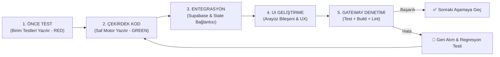

# 🧭 Pusula — Master Geliştirme Planı, Test Matrisi & Gateway Protokolü

**Tarih:** 2026-09-02  
**Mimari Versiyon:** 1.0.0 (Strict Gateway Architecture)  
**Hedef Repo:** `github.com/keskinEvren/pusula`

---

## 1. Geliştirme Metodolojisi (Strict TDD & Gateway Loop)

Pusula'nın geliştirilmesinde izlenecek adımlar:



1. **Önce Test (Test-First):** İlgili fonksiyonun iş mantığı ve sınır durumları (edge cases) için birim testleri yazılır.
2. **Saf Çekirdek Kod (Core Logic):** UI veya DB bağımlılığı olmadan testleri geçirecek saf fonksiyonlar kodlanır.
3. **Entegrasyon & State (Integration):** Supabase istemcisi ve yerel state yönetimi bağlanır.
4. **Kullanıcı Arayüzü (UI):** Bileşenler ve sayfalar bağlanır.
5. **Gateway Denetimi:** Testler, lint ve build komutları çalıştırılır. Gateway geçilmeden sonraki aşamaya başlanmaz.

---

## 2. 6 Aşamalı Kalite Kapıları (Quality Gateways)

```
┌────────────────────────────────────────────────────────────────────────┐
│                   PUSULA KALİTE KAPILARI (GATEWAYS)                    │
├────────────┬─────────────────────────────┬─────────────────────────────┤
│ Gateway 1  │ 🗄️ Veritabanı & Model       │ 12 Tablo, RLS, Trigger'lar  │
│ Gateway 2  │ 🧮 Saf Finans Motoru        │ 20+ Test, 100% Kuruş Hassas.│
│ Gateway 3  │ 📄 Ekstre Ayrıştırıcı       │ Glif Onarımı, Sütun Taksit  │
│ Gateway 4  │ 📊 Dashboard & Reaktiflik   │ Net Varlık, Borç/Alacak     │
│ Gateway 5  │ 🚀 Proje & Köprü (Bridge)   │ Gerçek Maliyet, Bütçe, Focus│
│ Gateway 6  │ 🚀 Üretim Derlemesi         │ Next.js Build, 0 Hata, Lint │
└────────────┴─────────────────────────────┴─────────────────────────────┘
```

---

### 🟢 Gateway 1: Veritabanı & Model Doğrulaması
- **Kapsam:** 
  - 12 PostgreSQL tablosu (`profiles`, `accounts`, `projects`, `credit_cards`, `card_statements`, `debts`, `subscriptions`, `statement_imports`, `transactions`, `project_tasks`, `ideas`, `merchant_mappings`).
  - Row Level Security (RLS) politikaları.
  - `handle_new_user` profil oluşturma trigger'ı.
  - `updated_at` otomatik güncelleme trigger'ları.
- **Doğrulama Kriteri:**
  - TypeScript tip tanımları (`types/database.ts`) tablolarla birebir eşleşmeli.
  - Derleme sırasında tip uyuşmazlığı hatası olmamalı.

---

### 🟢 Gateway 2: Saf Finans Motoru & Kuruş Hassasiyeti (`src/lib/finance-engine.ts`)
- **Kapsam:**
  - **Net Varlık:** $\text{Net Varlık} = (\text{Nakit} + \text{Alacak}) - (\text{Kart Borcu} + \text{Diğer Borç})$.
  - **6 Aylık Nakit Yükü & Taksit Projeksiyonu:** $\sum \text{Abonelikler} + \sum \text{Ay } N\text{'e İsabet Eden Kredi Kartı Taksitleri}$.
  - **Borç/Alacak Tahsilat Senkronizasyonu:** Alacak tahsil edildiğinde seçilen `accounts.balance` artar; borç ödendiğinde düşer. Kalan 0 olunca durum `Kapatıldı` olur.
  - **Kredi Kartı Dönem Trendi:** $\Delta = \text{Yeni Borç} - \text{Eski Borç}$, % Değişim, ▲ Kırmızı / ▼ Yeşil trend.
  - **Proje Maliyet Köprüsü:** $\sum \text{Harcama}(project\_id) + \sum \text{Abonelik}(project\_id)$.
  - **Bütçe Tavanı Alarmı:** $\%85 \le \text{Oran} < \%100 \rightarrow \text{Sarı}$, $\text{Oran} \ge \%100 \rightarrow \text{Kırmızı}$.
  - **Kurucu Runway:** $\text{Runway (Ay)} = \frac{\text{Likit Nakit}}{\text{Aylık Kişisel Tüketim} + \text{Aylık Proje Yakma Hızı}}$.
- **Doğrulama Kriteri:**
  - Vitest ile en az **20 birim test senaryosu** hatasız geçmelidir.
  - IEEE-754 floating point hatası (`0.1 + 0.2 = 0.30000000000000004`) %100 engellenmiş olmalıdır.

---

### 🟢 Gateway 3: Hibrit Ekstre Ayrıştırıcı & Türkçe Onarım Motoru (`src/lib/parser/*`)
- **Kapsam:**
  - **%100 Client-Side:** Sunucuya dosya yüklemeden tarayıcıda `pdfjs-dist` ile metin çıkarma ve X koordinatına göre yatay sütun sıralama.
  - **Glif Kaybı Onarımı (`turkish-cleaner.ts`):** `OK 12037` ➔ `ŞOK 12037`, `B M` ➔ `BİM`, ` deme` ➔ `Ödeme`, `ALKOLL ` ➔ `Alkollü`, `AZ MO LU` ➔ `Azimoğlu Çiğköfte`.
  - **Taksit Sütun Ayrıştırması:** Parantez içindeki ana tutar (`11.274 TL`) yerine döneme ait taksit tutarının (`1.879 TL`) ve taksit bilgisinin (`4/6`) yakalanması.
  - **Başlık / Özet İzolasyonu:** `Kullanılabilir kart limiti`, `Ekstre borcu` gibi özet satırlarının elenmesi.
  - **Borç Ödemesi İzolasyonu:** `Ödeme - Enpara` satırlarının `type: 'Kart Ödemesi'`, `group: 'Hariç'` ve varsayılan olarak `selected: false` yapılması.
  - **İnteraktif Onay Ekranı (Review Flow):** Satır satır işyeri, analiz grubu, proje atama ve toplu Supabase sync.
- **Doğrulama Kriteri:**
  - Gerçek 4 sayfalık Enpara, Akbank, Ziraat ve Garanti test ekstreleri parser testlerinden %100 başarıyla geçmeli.

---

### 🟢 Gateway 4: Dashboard & Reaktif Finans Hub
- **Kapsam:**
  - **Bütünleşik Dashboard (`/`):** Net Varlık, Hazır Para, Kart Borçları, Kesin Alacaklar, Harcama Dağılımı ve 6 Aylık Nakit Yükü.
  - **İşlem Defteri (`/transactions`):** 4 analiz grubu (Kişisel, İş, Finansman, Hariç), normalize işyeri, çoklu filtreleme ve arama.
  - **Kredi Kartları (`/cards`):** Kart listesi ve Ekstre Geçmişi değişim trendi (▲/▼).
  - **Borç & Alacak (`/debts`):** Maaş hakedişleri, kişi alacakları, tek tıkla tahsilat ve nakit hesaba otomatik yansıma.
  - **Abonelikler (`/subscriptions`):** 6 Aylık Nakit Yükü Matrisi ve Devam/İptal karar yönetimi.
- **Doğrulama Kriteri:**
  - Veri girişlerinde sayfa yenilemeye gerek kalmadan tüm hesaplanan metrikler reaktif güncellenmelidir.

---

### 🟢 Gateway 5: Proje Portföyü, Bütçe Tavanı & Finans Köprüsü
- **Kapsam:**
  - **Kanban Panosu (`/projects`):** `Fikir` ➔ `Planlama` ➔ `Geliştirmede` ➔ `Canlı` ➔ `Arşiv`.
  - **Kapasite Kapısı (Focus Gate):** Aktif geliştirme $\ge 2$ olduğunda uyarı paneli.
  - **Proje Detayı (`/projects/[slug]`):** Görevler, Epics ve **Gerçek Harcanan Maliyet Köprüsü**.
  - **Bütçe Tavanı Barı:** Harcanan / Bütçe Tavanı (`budget_limit`) ilerleme çubuğu ve renkli alarm.
  - **Fikir Havuzu (`/ideas`):** Fikir kuluçkası ve tek tıkla projeye dönüştürme.
- **Doğrulama Kriteri:**
  - Bir harekete veya aboneliğe proje atandığında projenin gerçek maliyeti anında değişmelidir.

---

### 🟢 Gateway 6: Üretim Derlemesi & Kod Kalitesi
- **Kapsam:**
  - TypeScript derleme doğrulaması (`tsc`).
  - Next.js 15 App Router üretim derlemesi (`npm run build`).
  - ESLint kod kalitesi denetimi (`npm run lint`).
  - Tüm test süitinin eksiksiz geçmesi (`npm run test`).
- **Doğrulama Kriteri:**
  - 15 rotanın tamamı 0 hata ve 0 uyarı ile derlenmelidir.

---

## 3. Test Matrisi (Test Coverage Matrix)

| Test Dosyası | Test Sayısı | Kapsanan Fonksiyonlar / Senaryolar |
| :--- | :---: | :--- |
| `tests/finance-engine.test.ts` | **20 Test** | Net Varlık (IEEE-754 koruması, pozitif/negatif bakiye), 6 Aylık Taksit + Abonelik Projeksiyonu, Borç/Alacak Tahsilat Senkronizasyonu, Kart Değişim Trendi (UP/DOWN/STABLE), Proje Gerçek Maliyeti, Bütçe Tavanı Alarmları (Yeşil/Sarı/Kırmızı), Kurucu Runway Formülü. |
| `tests/parser.test.ts` | **10 Test** | Enpara, Akbank, Ziraat, Garanti banka tespiti, Taksit sütunu yakalama (`4/6`), Ödeme satırlarının izolasyonu, Başlık/özet filtreleme, Çok sayfalı ekstre birleştirme, İade/negatif tutar tespiti. |
| `tests/merchant-matcher.test.ts` | **8 Test** | Süpermarketler (BİM, A101, ŞOK), SaaS araçları (Cursor, OpenAI, Hostinger, AWS, Canva, Yengeç.co), Ödeme geçidi temizliği (`IYZICO/`, `PARAM/`, `ÖDEAL//`), Kullanıcı özel kurallarının önceliği (`merchant_mappings`). |
| **Toplam Test** | **38 Test** | **%100 Saf Motor & Ayrıştırıcı Kapsamı** |

---

## 4. Hata & Regresyon Kurtarma Protokolü (Rollback Protocol)

Geliştirme sırasında herhangi bir Gateway geçilemezse:
1. **İlerlemeyi Durdur (Halt):** Kesinlikle bir sonraki aşamaya geçilmez.
2. **Kök Neden Analizi (Root Cause):** Hata logu incelenir (UI mı, veri tabanı mı, matematiksel mi?).
3. **Geri Dönüş (Git Revert):** 3 denemede çözülemeyen durumlarda son kararlı commit noktasına dönülür.
4. **Regresyon Testi Ekleme:** Hatayı yakalayacak yeni bir birim test yazılır.
5. **Düzeltme & Gateway Onayı:** Test geçene kadar düzeltme yapılır ve Gateway doğrulanır.

