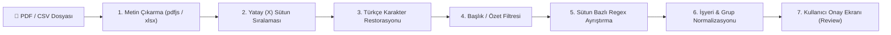

# 📄 Pusula — Ekstre Ayrıştırma Motoru Spesifikasyonu (Parser Spec)

Bu döküman, Türk bankalarının (Enpara, Akbank, Ziraat, Garanti vb.) ekstre PDF, CSV ve Excel dosyalarının nasıl ayrıştırıldığını, font kodlama hatalarının nasıl onarıldığını ve onay akışını tanımlar.

---

## 1. Mimari Genel Bakış

Ekstre ayrıştırma işlemi **%100 istemci tarafında (Client-Side / Browser)** çalışır. Kullanıcının PDF ekstreleri hiçbir sunucuya yüklenmez; tarayıcıda `pdfjs-dist` ile okunur, işlenir ve onaylandıktan sonra doğrudan Supabase'e yazılır.

---

## 2. Karşılaşılan Zorluklar ve Çözümler

### A. PDF Font Kodlama / Türkçe Karakter Kayıpları
Banka PDF'leri oluşturulurken Türkçe karakterlerin (Ö, Ş, İ, Ğ, Ü, Ç) glifleri bazen boşluk veya geçersiz bayt olarak basılır.

| PDF'ten Çıkan Ham Metin | Otomatik Onarılan Temiz Metin | Eşleşen İşyeri / Tür |
| :--- | :--- | :--- |
| ` deme - Enpara.com Cep  ubesi -` | `Ödeme - Enpara.com Cep Şubesi -` | `Kart Ödemesi (Enpara)` / `Hariç` |
| `OK 12037   L  AL  BEY` | `ŞOK 12037 ŞİŞLİ ALİBEY` | `ŞOK` / `Kişisel` |
| `B  M V387-BEYAZIT -  SK  DA` | `BİM V387-BEYAZIT - ÜSKÜDAR` | `BİM` / `Kişisel` |
| ` DEAL//ALMIRA PASTA` | `Ödeal // Almira Pasta` | `Almira Pasta` / `Kişisel` |
| `AZ  MO  LU  K  FTE DONDURM` | `AZİMOĞLU ÇİĞKÖFTE DONDURMA` | `Azimoğlu Çiğköfte` / `Kişisel` |
| `Alı  veri  faizi` | `Alışveriş faizi` | `Banka Faiz / Masraf` / `Finansman` |

### B. Taksitli İşlemlerde Ana Tutar vs. Dönem Tutarı
- **Problem:** `RIHTIM VE VERASET ... (İşlem tutarı: 11.274,00 TL) 4/6 1.879,00 TL` satırında parantez içindeki ana tutar (`11.274 TL`) değil, o aya ait taksit tutarı (`1.879 TL`) alınmalıdır.
- **Çözüm:** Regex satırın en sağındaki son sütun tutarını hedefler; `4/6` bilgisini `Taksit (4/6)` olarak `recurrence` alanına yazar.

### C. Başlık ve Özet Satırlarının Ayıklanması
Aşağıdaki ifadeleri içeren satırlar işlem/hareket sayılmaz ve filtrelenir:
- `Kullanılabilir kart limiti`
- `Kart limiti`, `Kart numarası`
- `Ekstre borcu`, `Minimum ödeme tutarı`
- `Son ödeme tarihi`, `Ekstre tarihi`
- `Bir önceki ekstre bakiyeniz / borcu`
- `Harcamalar ve yansıyan taksitler`
- `Nakit avans / Artı bakiye transferi`
- `Faiz, vergiler, ücretler ve diğer`
- `İşlem tarihi Açıklama Taksit Tutar`
- `Sayfa X / Y`, `Kart sahibinin T.C.`
- `numaralı sanal kredi kartınızla yapılan işlemler`

---

## 3. Desteklenen Banka Şablonları

1. **Enpara (QNB Finansbank):**
   - Format: `[İşlem Tarihi] [Açıklama] [Opsiyonel Taksit] [Tutar TL]`
2. **Akbank (Axess / Wings):**
   - Format: `[Tarih] [Açıklama] [Tutar]`
3. **Ziraat Bankası (Bankkart):**
   - Format: `[İşlem Tarihi] [Açıklama] [Tutar]`
4. **Garanti BBVA (Bonus):**
   - Format: `[Tarih] [Açıklama] [Tutar]`
5. **Genel Fallback:**
   - Satır başında tarih, satır sonunda para formatı olan tüm standart banka dökümleri.
