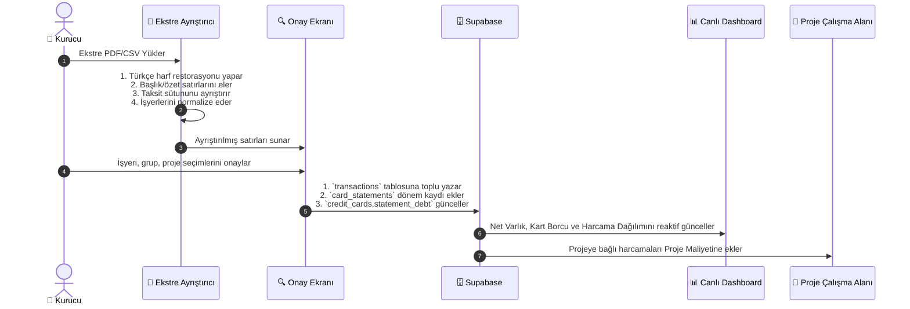

# ⚡ Pusula — Sistem Dinamikleri & Olay Akışları (System Dynamics)

Bu döküman, Pusula'da gerçekleşen bir olayın (Event) sistemdeki diğer varlıkları ve finansal dengeleri **nasıl zincirleme etkilediğini** detaylandırır.

---

## 🔄 1. Olay: Ekstre PDF/CSV Yüklendiğinde (Statement Ingestion)



### Zincirleme Etkiler:
1. **Borç Ödemesi Ayrımı:** Ekstredeki `Ödeme - Enpara` gibi satırlar `Kart Ödemesi` (`Hariç`) olarak işaretlenir. Bu sayede hem kart borcu hem de ödeme ikinci kez harcama olarak **çift sayılmaz**.
2. **Kredi Kartı Trendi:** Kartın bir önceki ekstre borcu ile yeni ekstre borcu kıyaslanır; aradaki fark (▲ Artış / ▼ Azalış) ve yüzde değişimi hesaplanarak ekstre geçmişine işlenir.
3. **Proje Maliyeti:** Ekstredeki `Hostinger`, `Meta Ads`, `Canva` gibi hareketlere bir `project_id` seçildiyse, ilgili projenin harcanan bütçesi otomatik olarak artar.

---

## 💸 2. Olay: Manuel Hareket Girişi Yapıldığında (Transaction Event)

```mermaid
flowchart TD
    A["➕ Yeni Hareket Girişi"] --> B{"Ödeme Aracı Nedir?"}
    
    B -->|Vadesiz Hesap / Nakit| C["`accounts.balance` Düşer"]
    B -->|Kredi Kartı| D["`credit_cards.current_debt` Artar"]

    A --> E{"Analiz Grubu Nedir?"}
    E -->|Kişisel| F["Kişisel Tüketime Eklenir"]
    E -->|İş / Proje| G{"Bağlı Proje Var mı?"}
    E -->|Finansman| H["Finansman Maliyetine Eklenir"]
    E -->|Hariç| I["Tüketimden Muaf Tutulur"]

    G -->|Evet| J["`projects.total_cost` Canlı Yükselir"]
    G -->|Hayır| K["Genel İş Giderine Yazılır"]

    C & D & F & H & J --> L["📊 Dashboard Net Varlık & Runway Anında Güncellenir"]
```

---

## 🤝 3. Olay: Alacak Tahsilatı veya Borç Geri Ödemesi (Debt/Receivable Settlement)

```mermaid
flowchart TD
    A["🤝 Tahsilat / Geri Ödeme Gerçekleşti"] --> B{"İşlem Türü Nedir?"}

    B -->|Alacak Tahsilatı (Maaş / Hakediş)| C["`debts.past_payments` Artar<br/>`debts.remaining` Düşer"]
    B -->|Borç Geri Ödemesi (Şahıs / Artı Para)| D["`debts.past_payments` Artar<br/>`debts.remaining` Düşer"]

    C --> E{"Kalan Bakiye 0 mı?"}
    D --> E
    E -->|Evet| F["Durum: `Kapatıldı` olarak pasife geçer"]
    E -->|Hayır| G["Durum: `Açık` kalmaya devam eder"]

    C --> H["Nakit Girişi ➔ `accounts.balance` Yükselir"]
    D --> I["Nakit Çıkışı ➔ `accounts.balance` Düşer"]

    H & I & F & G --> J["📊 Net Varlık & Borç/Alacak Dengesi Anında Güncellenir"]
```

---

## ⏰ 4. Olay: Abonelik ve Tekrarlayan Servis Yönetimi (Subscription Lifecycle)

1. **Abonelik Tanımlandığında:**
   - Gelecek 6 ayın planlı nakit yükü tablosuna aylık/periyodik yük olarak yansır.
   - Eğer `project_id` seçildiyse, projenin aylık yakma hızına (burn rate) eklenir.
2. **Karar Değiştiğinde (`İptal Et` seçildiğinde):**
   - Karar panelinde işaretlenir; yenileme gün sayacı alarm verir.
   - İptal gerçekleştiğinde `status: 'İptal'` yapılır ve 6 aylık nakit yükünden otomatik düşer.

---

## 🚀 5. Olay: Proje Yaşam Döngüsü & Odak Kapasitesi (Focus Gate)

1. **Fikir Aşaması:** `ideas` havuzunda depolanır.
2. **Projeye Dönüştürme:** Fikir onaylandığında tek tıkla `projects` tablosunda `status: 'Fikir'` veya `'Planlama'` olarak yeni proje açılır.
3. **Kapasite Kapısı (Focus Gate):**
   - Sistem sürekli şu sorguyu çalıştırır:
     $$\text{Aktif Geliştirme} = \text{Count}(\text{status} \in \{\text{'Planlama'}, \text{'Geliştirmede'}\})$$
   - $\text{Aktif Geliştirme} \ge 2$ olduğunda sistemde **"Kapasite Dolu"** uyarısı tetiklenir. Kurucu mevcut projelerden birini bitirmeden veya askıya almadan yeni geliştirmeye başlamamaya yönlendirilir.
4. **Maliyet Muhasebesi:** Proje detay sayfası açıldığında, o projeye ait tüm geçmiş tekil harcamalar ve aktif abonelikler toplanarak **"Bu projenin bugüne kadarki gerçek maliyeti"** olarak gösterilir.
