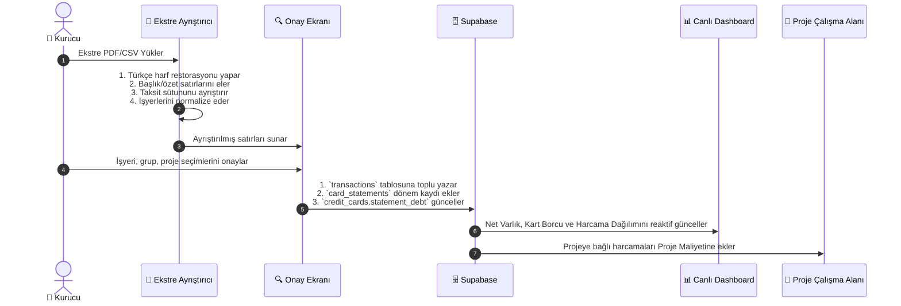

# ⚡ Pusula — Sistem Dinamikleri & Olay Akışları (System Dynamics)

Bu döküman, Pusula'da gerçekleşen bir olayın (Event) sistemdeki diğer varlıkları ve finansal dengeleri **nasıl zincirleme etkilediğini** detaylandırır.

---

## 🔄 1. Olay: Ekstre PDF/CSV Yüklendiğinde (Statement Ingestion)



### Zincirleme Etkiler:
1. **Borç Ödemesi Ayrımı:** Ekstredeki `Ödeme - Enpara` gibi satırlar `Kart Ödemesi` (`Hariç`) olarak işaretlenir. Bu sayede hem kart borcu hem de ödeme ikinci kez harcama olarak **çift sayılmaz**.
2. **Kredi Kartı Trendi:** Kartın bir önceki ekstre borcu ile yeni ekstre borcu kıyaslanır; aradaki fark (▲ Artış / ▼ Azalış) ve yüzde değişimi hesaplanarak ekstre geçmişine işlenir.
3. **Proje Maliyeti:** Ekstredeki `Hostinger`, `Meta Ads`, `Canva` gibi hareketlere bir `project_id` seçildiyse, ilgili projenin harcanan bütçesi otomatik olarak artar.

---

## 💸 2. Olay: Manuel Hareket Girişi Yapıldığında (Transaction Event)

```mermaid
flowchart TD
    A["➕ Yeni Hareket Girişi"] --> B{"Ödeme Aracı Nedir?"}
    
    B -->|Vadesiz Hesap / Nakit| C["`accounts.balance` Düşer"]
    B -->|Kredi Kartı| D["`credit_cards.current_debt` Artar"]

    A --> E{"Analiz Grubu Nedir?"}
    E -->|Kişisel| F["Kişisel Tüketime Eklenir"]
    E -->|İş / Proje| G{"Bağlı Proje Var mı?"}
    E -->|Finansman| H["Finansman Maliyetine Eklenir"]
    E -->|Hariç| I["Tüketimden Muaf Tutulur"]

    G -->|Evet| J["`projects.total_cost` Canlı Yükselir"]
    G -->|Hayır| K["Genel İş Giderine Yazılır"]

    C & D & F & H & J --> L["📊 Dashboard Net Varlık & Runway Anında Güncellenir"]
```

---

## 🤝 3. Olay: Alacak Tahsilatı veya Borç Geri Ödemesi (Debt/Receivable Auto-Sync)

```mermaid
flowchart TD
    A["🤝 Tahsilat / Geri Ödeme Gerçekleşti"] --> B{"İşlem Türü Nedir?"}

    B -->|Alacak Tahsilatı (Maaş / Hakediş)| C["`debts.past_payments` Artar<br/>`debts.remaining` Düşer"]
    B -->|Borç Geri Ödemesi (Şahıs / Artı Para)| D["`debts.past_payments` Artar<br/>`debts.remaining` Düşer"]

    C --> E{"Kalan Bakiye 0 mı?"}
    D --> E
    E -->|Evet| F["Durum: `Kapatıldı` olarak pasife geçer"]
    E -->|Hayır| G["Durum: `Açık` kalmaya devam eder"]

    C --> H["Nakit Girişi ➔ Seçilen `accounts.balance` Otomatik Yükselir"]
    D --> I["Nakit Çıkışı ➔ Seçilen `accounts.balance` Otomatik Düşer"]

    H & I & F & G --> J["📊 Net Varlık & Nakit Bakiyesi Anında Güncellenir"]
```

---

## ⏰ 4. Olay: 6 Aylık Planlı Nakit Yükü Projeksiyonu (Abonelikler + Taksitler)

Sistem gelecek 6 ayın nakit çıkış yükünü sadece aboneliklerden değil, **kredi kartlarının devam eden taksitlerinden** de hesaplar:

$$\text{Ay } N \text{ Nakit Yükü} = \sum \text{Aktif Aylık Abonelikler} + \sum \text{Ay } N\text{'e İsabet Eden Kredi Kartı Taksitleri}$$

1. **Abonelikler:** Her ay düzenli yük (Örn: Cursor ₺960 + ChatGPT ₺1.090 = ₺2.050/ay).
2. **Taksitler:** Devam eden taksitler (Örn: `RIHTIM VE VERASET 4/6` ➔ Gelecek 2 ay boyunca her ay ₺1.879 ek nakit yükü).
3. **İptal Kararı:** Abonelik `İptal Et` işaretlendiğinde veya kapatıldığında projeksiyondan anında düşer.

---

## 🚀 5. Olay: Proje Yaşam Döngüsü & Bütçe Tavanı (Budget Cap & Focus Gate)

1. **Fikir Aşaması:** `ideas` havuzunda depolanır.
2. **Projeye Dönüştürme:** Fikir onaylandığında tek tıkla `projects` tablosunda `status: 'Fikir'` veya `'Planlama'` olarak yeni proje açılır; opsiyonel bir **Bütçe Tavanı (`budget_limit`)** belirlenir (Örn: ₺20.000).
3. **Bütçe Kontrol Dinamiği:**
   - $\text{Harcanan} \ge \text{Bütçe} \times 0.85$ ➔ 🟡 **Yaklaşan Bütçe Uyarısı**
   - $\text{Harcanan} \ge \text{Bütçe}$ ➔ 🔴 **Bütçe Aşımı Uyarısı**
4. **Kapasite Kapısı (Focus Gate):**
   - Aktif geliştirme sayısı $\ge 2$ olduğunda kurucu uyarılır.
5. **Maliyet Muhasebesi (Bridge):**
   - $\text{Proje Gerçek Maliyeti} = \sum \text{Transactions}(project\_id) + \sum \text{Subscriptions}(project\_id)$
   - Her harcama ve abonelik projeye anında yansır.
